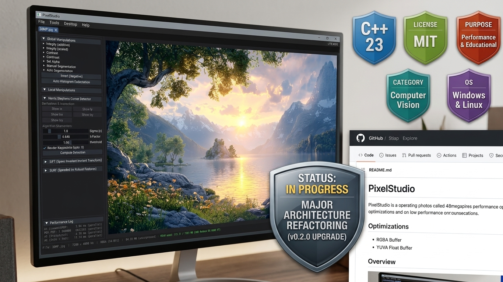
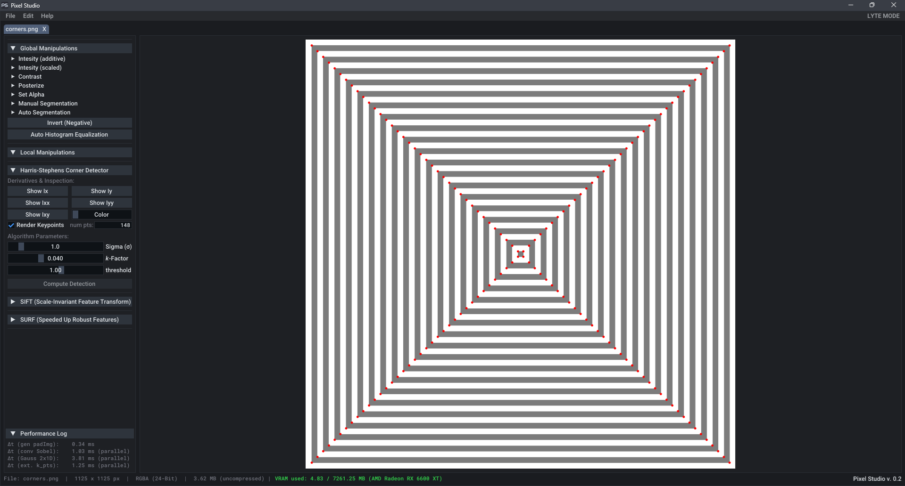
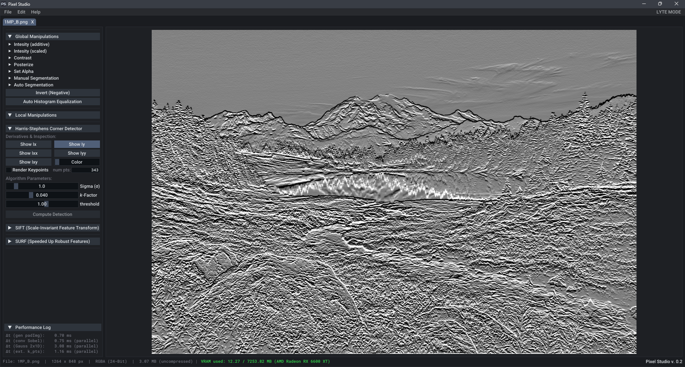
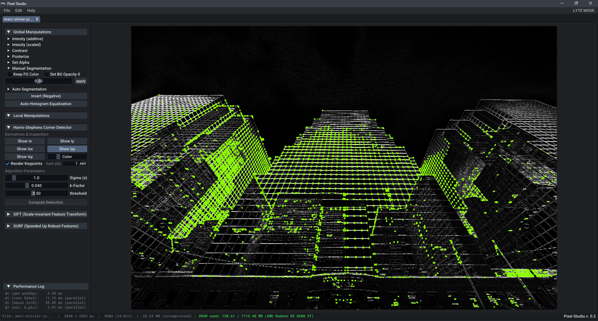
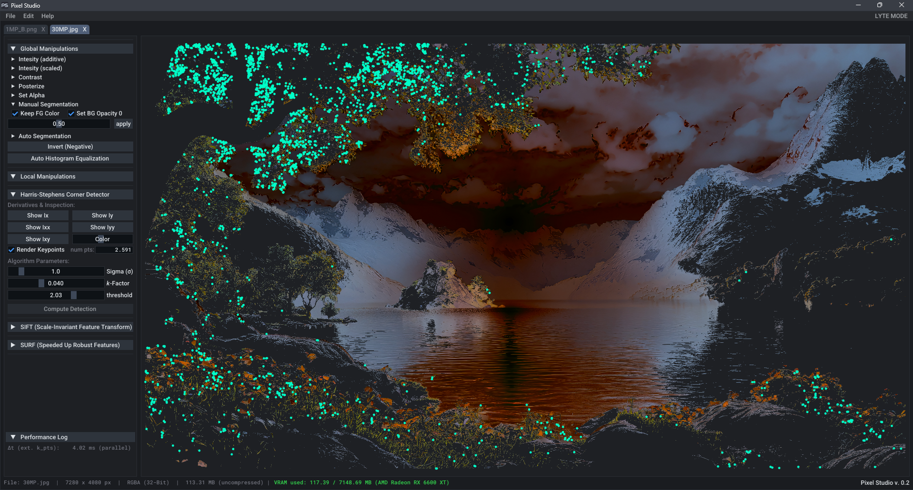

# Pixel Studio v0.2.0

     

> A high-performance, cross-platform C++23 Image Processing & Computer Vision Analytics Engine. Engineered with an **Immediate Mode UI (Dear ImGui)**, **OpenMP parallelization**, **Structure-of-Arrays (SoA)** memory layouts, and zero-overhead GPU telemetries.

<p align="center">
  
</p>

---

## 📸 Overview & Purpose

**Pixel Studio** was designed as a dual-purpose engine:

1. **Computer Vision Educational Inspection Platform:**
   Built specifically to visualize and intuitively understand complex CV algorithms (such as **Harris Corner Detection** and upcoming multi-scale descriptors like **SIFT** and **SURF**). With real-time slider updates, step-by-step pipeline inspection (Sobel gradients, Gaussian smoothing, keypoint thresholds), students and engineers can inspect algorithm internals down to the raw pixel level.
2. **High-Performance C++ Engineering:**
   Engineered from the ground up to handle high-resolution imagery (up to **48 Megapixels+**) with sub-second execution times. It serves as a real-world benchmark for low-level system design, thread parallelism, and hardware-aware resource management.

---

## ⚡ High-Impact Features & Architecture Highlights

### 🎯 1. O(1) Stamp-Based Validation & Invalidation System
To prevent redundant computation across multi-stage image processing pipelines, PixelStudio incorporates an $O(1)$ **Stamp Verification Engine**:
* Answers pipeline questions instantly: *Does the active RGBA display vector match the selected image? Is the cached `padImg` based on the current image? Has Harris Detection executed on this exact dataset version?*
* Eliminates buffer thrashing and invalidates downstream passes **only when parent parameters change**.

### 🧬 2. SIMD-Friendly YUVA Structure-of-Arrays (SoA)
Instead of processing redundant RGB channels across spatial convolution filters, Pixel Studio converts image data into a decoupled **YUVA planar format**:
* **Luminance-Centric Processing:** Very much all image manipulations and spatial operations (Sobel, Gaussian) operate exclusively on the $Y$ (Luminance) channel. Color fidelity ($U/V$) and transparency ($A$) remain strictly preserved with zero color degradation.
* **Cache Efficiency:** 1-channel linear traversals maximize L1/L2 cache hit rates compared to interleaved (AoS) formats.
* **Single Active RGBA Buffer:** Only **one** global RGBA vector is materialized in RAM for display rendering, alongside the current image YUVA structures.

### 🧵 3. Thread Parallelism via OpenMP
* High-intensity spatial convolutions (Sobel derivatives, separable 1D Gaussian blurs, Non-Maximum Suppression) and any heavy lifting image manipulation algorithms are accelerated using **OpenMP loop parallelization**.
* To prevent UI thread lockups and complex race conditions within the Immediate Mode GUI, thread parallelism is strictly constrained to the processing algorithms - keeping the UI event loop completely deterministic and serial.

### 🖥️ 4. Hardware-Aware System Inspection (`SysInfo`)
Pixel Studio queries hardware topologies dynamically at initialization:
* **Physical Core Affinity:** Filters out virtual logical threads (Hyper-Threading / SMT) to determine the actual number of physical cores and automatically calculates the **optimal OpenMP chunk size** for the running system.
* **Native OS Integration:** Leverages OS-native FileChoosers (with pre-configured extension filters) and automatically syncs the UI theme (Light/Dark Mode) with system preferences upon startup.
* **Cross-Platform Resilience:** Uses conditionally compiled platform shims (`#defines`) to ensure clean compilation across Windows and Linux (CachyOS/GCC/Clang).

### 📐 5. Scalable Immediate Mode UI (`UIComponents`)
* **Custom-crafted UI elements:** `CustomMenuItem`, `CustomTabButton`, `ThemeToggleButton`, and `ToggleButton`.
* **DPI-Aware Scaling Engine:** Dynamically queries screen DPI at application launch to establish an absolute base scaling factor (`UI::em`). All UI dimensions, padding, and font hierarchies are pre-scaled once at startup - eliminating runtime layout recalculation during ImGui frames.

### 📊 6. Deterministic VRAM Tracking & Telemetry
* **Deterministic Local Accounting:** Initialized via native OpenGL driver queries at startup, followed by immediate, zero-latency byte-level tracking ($+ \text{Alloc} / - \text{Dealloc}$) on every GPU texture mutation and window/viewport resize event - bypassing blocking GPU driver polling during event-driven GUI loops (`glfwWaitEvents`).
* **Smart Texture Lifecycle:** VRAM textures for intermediate gradient inspection ($I_x, I_y, I_{xx}, I_{yy}, I_{xy}$) are loaded lazily on-demand and freed during algorithm rebuilds or tab closures.
* **Live Status Indicator:** Real-time color-coded feedback (🟢 `GOOD` < 60%, 🟡 `WARN` 60–85%, 🔴 `ALERT` > 85%) warns users of system VRAM pressure.

### 🛡️ 7. Exception-Free Diagnostics & Telemetry Frame
* **Safety-Critical Design Pattern:** Built strictly around deterministic error propagation (`-fno-exceptions` compatible) to eliminate non-deterministic stack-unwinding overhead and guarantee complete control over failure states within critical processing loops.
* **Non-Blocking Telemetry & Status Pipeline:** Implements a lightweight status-code, log, and metrics tracking system that channels internal warnings, file I/O states, and algorithm metrics directly into non-interfering UI toasts and status monitors.
* **Guaranteed Control Flow:** Pipeline and asset failures (e.g., via C-style `stb` error status checks) are gracefully captured through explicit result propagation, ensuring zero thread stagnation and 100% deterministic execution under all conditions.

---

## 🖼️ Interactive Showcase & Inspection Views

<div align="center">

### 🎯 Mathematical Precision & Synthetic Verification
*Rigorous validation of the Harris-Stephens implementation using a synthetic geometric calibration grid. All 148 keypoints are detected with zero false positives along edge contours, confirming exact Eigenvalue computation and Non-Maximum Suppression (NMS).*



---

### 🔬 Pipeline Inspection & Feature Detection

| Vertical Gradient Matrix ($I_y$) | Architecture Feature Density ($I_{yy}$) |
| :---: | :---: |
|  |  |
| *Real-time $I_y$ spatial gradient visualization via OpenMP-accelerated Sobel convolution.* | *Stress-testing on complex real-world data ($3648 \times 2365$ px) detecting 7,400+ keypoints with custom color overlays.* |

---

### 🎨 Bonus: Creative Pipeline Synthesis *(Optional)*
*Demonstrating multi-stage execution—combining image inversion, color-space segmentation, and parallel feature extraction on a 30 MP landscape composition.*



</div>

---

## 🔬 Performance Benchmarks

*Evaluated on a **48 Megapixel (8000 × 6000)** image payload:*

| Pipeline Stage | Processing Time ($\Delta t$) | Description |
| :--- | :--- | :--- |
| **Sobel Gradient Pass** | ` ~55.24 ms` (parallel) | Dual-axis gradient calculation ($I_x, I_y$) |
| **Separable Gaussian (5x1D)** | `~141.88 ms` (parallel) | Horizontal/Vertical smoothing pass ($I_{xx}, I_{yy}, I_{xy}$) |
| **Keypoint Extraction (NMS)** | ` ~12.08 ms` (parallel) | Candidate filtering (**249,679 points @ $t=0.05$**) |
| **Total Pipeline Rebuild** | `~220 ms` (parallel) | Full end-to-end execution on 48MP input |

---

## 🗺️ Roadmap & Future Enhancements

* **`uint8_t` YUVA Memory Refactor:** Transitioning internal floating-point buffers to integer-aligned `uint8_t` layouts to cut memory footprints by **75%** and unlock AVX2/AVX-512 vectorization.
* **Multi-Scale Feature Descriptors:** Implementing scale-space pyramids for **SIFT** and **SURF** feature detection and matching pipelines.

---

## 🛠️ Toolchain, Dependencies & Build Guide

### 🧱 Core Architecture & Dependencies

* **Language Standard:** Modern C++23
* **GUI Framework:** [Dear ImGui](https://github.com/ocornut/imgui) (by Omar Cornut) backed by [GLFW](https://www.glfw.org/)
* **Image I/O:** [stb library](https://github.com/nothings/stb) (by Sean Barrett) for single-header loading/saving
**Parallelization:** [OpenMP](https://www.openmp.org/) 5.0+ (Multi-threaded processing for all parallelizable image algorithms)
* **Graphics API:** OpenGL 3.3+ (Core Profile)
* **Target Platforms:** Windows 11 & Linux (CachyOS / Ubuntu)

---

### 🚀 Building from Source

Pixel Studio relies on a clean, vendor-decoupled folder layout (`/include`, `/src`, `/external`). Pre-compiled static libraries and third-party headers reside within `/external`.

#### 1. Prerequisites
Ensure you have a modern C++23 compliant toolchain installed (e.g., **LLVM/Clang 16+** or **GCC 13+**).

> **Note on OpenMP Support:**
> While Pixel Studio automatically builds and runs in **serial fallback mode** if OpenMP is omitted, installing OpenMP support is strongly recommended to unleash full multi-threaded performance on multi-core CPUs.

> **Note on Folder Structure & Default Paths:**
> Pixel Studio relies on relative project paths upon initialization. Place your test input images inside the `defaultDIR/IN/` directory. Exported results target `defaultDIR/OUT/` by default unless overridden via the OS-native FileChooser.

#### 2. Clone & Build (Windows / MSYS2 / Clang)

```bash
# Clone the repository
git clone https://github.com/iibram/PixelStudio.git

# Change into project root
cd PixelStudio

# Build third-party dependencies once (ImGui & GLAD)
clang++ -std=c++23 -O3 -w -isystem "./external/include" -isystem "./external/include/ImGui" -c external/include/ImGui/*.cpp
clang++ -O3 -w -isystem "./external/include" -c external/include/glad/glad.c

# Move generated .o files to external/lib
mv *.o external/lib/

# Unter Windows
cmd: move *.o external\lib\

# Compile Windows resources (Icon)
windres resources.rc -O coff -o icon.o

# Compile release build with SIMD vectorization and system link flags
clang++ -std=c++23 -O3 -march=native -ffast-math \
    -isystem "./external/include" \
    -I"./include" \
    src/*.cpp ./external/lib/*.o icon.o \
    -L"./external/lib" \
    -fopenmp -lomp -lglfw3 -lopengl32 -lgdi32 -limm32 -lcomdlg32 \
    -o "./PixelStudio.exe"

# Launch the engine
./PixelStudio.exe
```
---

## 👤 Author & Project Status

* **Author:** [Ibrahim Ibram](https://github.com/iibram)
* **Status:** Active Open-Source Project

> **Development Note:**
> PixelStudio is under active evolution. APIs, internal layout IDs, and pipeline methods may be refactored as new multi-scale algorithms (SIFT/SURF) and memory optimizations are integrated.

---

## 📄 License

This project is licensed under the **MIT License** – see the [LICENSE](LICENSE) file for full details.

---
