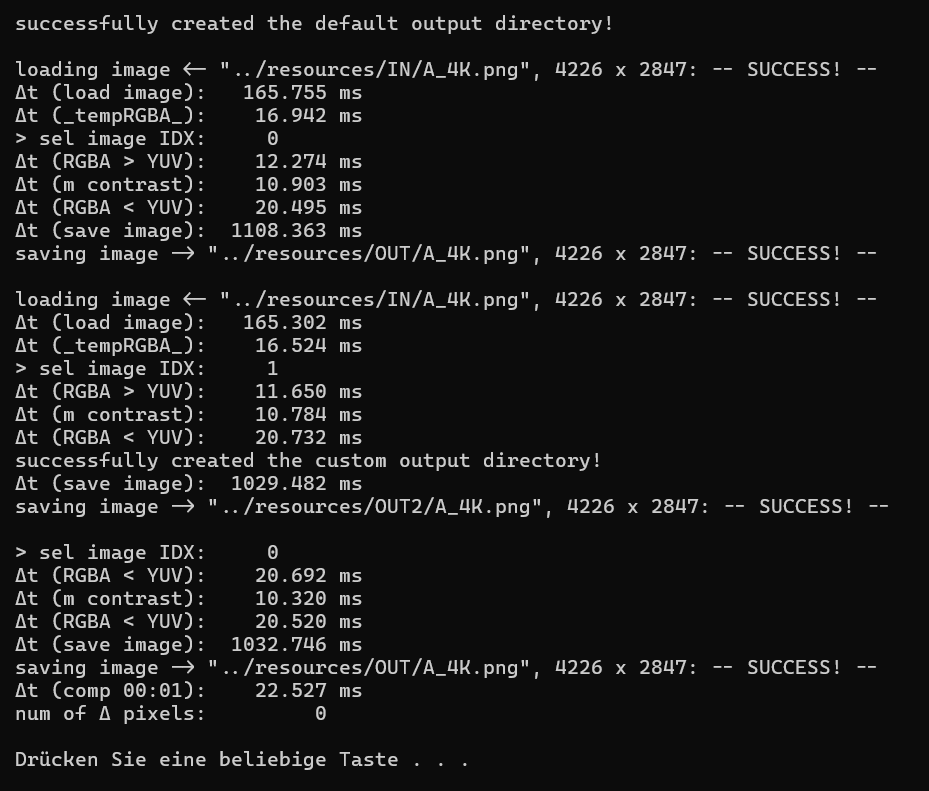

# PixelStudio (Backend Core)

    

A lightning-fast, highly optimized C++ image processing backend designed from the ground up for seamless integration with a future **Dear ImGui** cross-platform graphical user interface.

This repository represents the rock-solid computational core (the backend) of an upcoming custom image editing suite built for **Windows** and **Linux**.

<p align="center">
  
  <br>
  <em>Figure 1: Terminal execution output showing performance benchmarks and pipeline execution from main().</em>
</p>

---

## 🚀 Key Architectural Highlights

* **Decoupled Architecture:** Designed specifically with a clean *separation of concerns*. The backend (`ImageProcessor`) operates independently, making the integration of the upcoming ImGui view layer a straightforward and clean plug-and-play process.

* **Internal YUV + Alpha Format (YCbCrA):** Instead of chewing through cumbersome RGB channels for every single modification, the engine converts images internally into a custom extended YUV format.

	* Most standard manipulations (e.g., contrast, brightness) only touch the **Y (Intensity/Luma)** channel in the interval $[0, 1]$, slashing computational overhead.

	* More complex color adjustments selectively tap into the **U and V** chrominance channels without ever needing heavy 3-channel RGB matrix recalculations on the fly.

* **Blazing Fast Performance:**

	* Optimized via low-level pointer arithmetic, smart memory management, and zero unnecessary vector re-allocations during ad-hoc updates.

	* Transforms a massive **4K image (4226 x 2847)** back into an RGBA display buffer in roughly **20 milliseconds**, ensuring silky-smooth, real-time feedback for the upcoming UI frames.

* **Mathematical Precision:** Designed for near-lossless roundtrip accuracy. Converting from RGBA to YUV and back achieves a 100% reconstruction rate (0.0 pixel delta) under standard mathematical operations.

---

## 📂 Repository Structure

```text
PixelStudio/
├── resources/
│   ├── IN/                 # Included lossless/free test assets (including 4K samples)
│   ├── OUT/                # Output directories generated by processing tasks
│   └── showcase/           # Contains console output visual assets for documentation
├── src/                    # Core C++ source files
│   ├── external/           # Header-only dependencies (Sean Barrett's "stb" library)
│   ├── ImageProcessor.hpp  # Class declaration, internal structures, and inline helpers
│   ├── ImageProcessor.cpp  # Engine logic: YUV transformations, contrast filters, and high-performance pixel checks
│   └── main.cpp            # Execution entry point demonstrating the pipeline and timing benchmarks
├── .gitignore              # Specifies intentionally untracked files to ignore
├── LICENSE                 # MIT License File
└── README.md               # Project documentation and architecture overview
```

### Module Breakdown

* **`ImageProcessor.hpp`:** Defines the core `ImageProcessor` class interface, vector storage containers (`std::vector<Image>`), memory buffers (`tempRGBA`), and performance timing structures.

* **`ImageProcessor.cpp`:** Implements the heavy-lifting computational logic — including rapid raw buffer mapping from `stb`, bi-directional color space conversions (`toYUV()`, `toRGBA`), pixel-level adjustments, and optimized validation loops.

* **`main.cpp`:** Orchestrates test image ingestion, multi-stage contrast cascades, file exports, and real-time benchmark logging to the console.

---

## 🛠️ Tech Stack, Prerequisites & Getting Started

### Tech Stack & Dependencies

**Language:** Modern C++

**Image I/O:** Uses [Sean Barrett](https://github.com/nothings/stb)’s header - only **stb_image** and **stb_image_write** libraries strictly for fast file loading, saving, and dimension retrieval.

**Platform Support:** Cross-platform compatible (currently tested and optimized on Windows 11 and Linux/CachyOS).

### Prerequisites

* A modern C++ compiler supporting **C++20** (e.g., `g++` 11+, `clang` 13+, or MSVC latest).

### Build & Run

Clone the repository, drop your test images into the `resources/IN/` folder (or use the provided ones), compile the backend, and let the pixels fly!

```bash
# Clone the repository
git clone https://github.com/iibram/PixelStudio.git

# Change directory
cd PixelStudio

# Compile all source files with high-level performance optimization
g++ -std=c++20 -O2 -march=native -ffast-math src/*.cpp -o main

# Run the engine
./main
```
---

## 🗺️ Future Roadmap

### ✅ Done
- [x] **Core Image I/O Pipeline:** Integrated Sean Barrett’s `stb` library for fast, reliable image decoding, encoding, and dimension scaling.
- [x] **Optimized Backend Engine (`ImageProcessor`):** Established the YUV+A internal data model, achieving lightning-fast conversions, memory-efficient pointer operations, and sub-millisecond validation loops.

### 🚀 In Progress / Upcoming
- [ ] **Dear ImGui Integration:** Implementing the cross-platform GUI view, complete with a unified file-chooser system and real-time canvas rendering.
- [ ] **Interactive Ad-Hoc Editing:** Immediate visual feedback in the GUI as sliders and adjustments are tweaked.
- [ ] **Multi-threaded Batch Processing:** A dedicated, cancellable worker-thread system for heavy batch operations that runs safely in the background while keeping the main GUI fully responsive and interactive.
- [ ] **Advanced Features:** Long-term plans include integrating computer vision techniques such as Image Segmentation and Feature Detection.

---

## 📄 License
*Note on licensing for active development:* Even during early-stage or unpolished development phases, applying an open-source license like the MIT License establishes clear usage terms for collaborators and anyone reviewing the codebase.

This project is licensed under the MIT License - see the [LICENSE](LICENSE) file for details.
